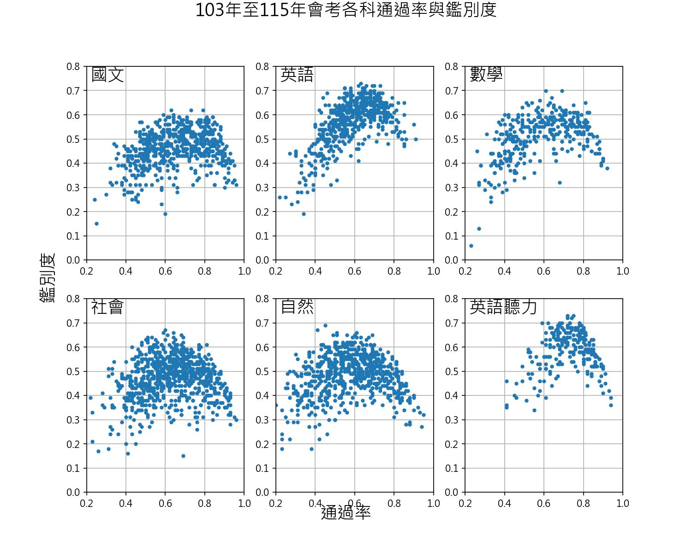

# 國中教育會考與基測題庫及統計分析系統

本專案是一個針對**國中教育會考（CAP）及國民中學學生基本學力測驗（基測）**的學科試題庫與數據分析系統。本系統以**生物科**為核心，收錄歷年完整試題，並針對各學科的**通過率（Pass Rate）**與**鑑別度（Discrimination Index）**進行深度統計分析與視覺化。

專案包含：
1. **題庫整理與輸出系統**：自動解析試題 PDF、轉換非標準影像、對齊考題欄位，並匯出為結構化的 CSV 與網頁格式。
2. **D3.js 數據視覺化平台**：提供動態散佈圖，可交互式探索與播放各科歷年通過率與鑑別度的分佈與演變趨勢。
3. **線上互動答題程式**：使用者可依「章節主題」或「考試年度」篩選題目進行線上測驗，提供即時評分與錯題分析。
4. **歷年科目指標報表**：包含國文、英語、數學、社會、自然及生物科的鑑別度與通過率統計網頁。

---

## 🌐 線上展示連結 (GitHub Pages)

本專案的靜態網頁與視覺化工具已託管於 GitHub Pages，您可以透過以下連結即時存取：

*   **數據視覺化**
    *   [各科通過率與鑑別度 D3 互動視覺化圖表](https://chihhsiangchien.github.io/question_database/d3/index.html)
*   ** 生物科分類題庫**
    *   [依章節主題分類題庫](https://chihhsiangchien.github.io/question_database/生物題庫_概念.html)
    *   [依考試年度分類題庫](https://chihhsiangchien.github.io/question_database/生物題庫_年度.html)
*   ** 統計與指標分析**
    *   [歷年章節與出處分析報表](https://chihhsiangchien.github.io/question_database/統計/統計.html)
    *   歷年科目指標快速連結：
        *   **生物科**：[鑑別度統計](https://chihhsiangchien.github.io/question_database/統計/統計_生物鑑別度.html) ｜ [通過率統計](https://chihhsiangchien.github.io/question_database/統計/統計_生物通過率.html)
        *   **國文科**：[鑑別度統計](https://chihhsiangchien.github.io/question_database/統計/統計_國文_鑑別度.html) ｜ [通過率統計](https://chihhsiangchien.github.io/question_database/統計/統計_國文_通過率.html)
        *   **英語科**：[鑑別度統計](https://chihhsiangchien.github.io/question_database/統計/統計_英語_鑑別度.html) ｜ [通過率統計](https://chihhsiangchien.github.io/question_database/統計/統計_英語_通過率.html)
        *   **數學科**：[鑑別度統計](https://chihhsiangchien.github.io/question_database/統計/統計_數學_鑑別度.html) ｜ [通過率統計](https://chihhsiangchien.github.io/question_database/統計/統計_數學_通過率.html)
        *   **社會科**：[鑑別度統計](https://chihhsiangchien.github.io/question_database/統計/統計_社會_鑑別度.html) ｜ [通過率統計](https://chihhsiangchien.github.io/question_database/統計/統計_社會_通過率.html)
        *   **自然科**：[鑑別度統計](https://chihhsiangchien.github.io/question_database/統計/統計_自然_鑑別度.html) ｜ [通過率統計](https://chihhsiangchien.github.io/question_database/統計/統計_自然_通過率.html)



---

## 📁 專案檔案結構

以下為本專案的主要目錄與檔案說明：

*   **[`data/`](./data)**：存放各科目題庫及通過率與鑑別度 CSV 資料檔。
    *   **[`database.csv`](./data/database.csv)**：生物科核心題庫資料庫，包含題目、選項、答案、出處章節、圖檔路徑及統計指標等。
    *   各科題庫 CSV：[國文](./data/chinese.csv)、[英語](./data/english.csv)、[數學](./data/math.csv)、[自然](./data/nature.csv)、[社會](./data/society.csv)。
    *   整合指標：[合併後的通過率與鑑別度.csv](./data/合併後的通過率與鑑別度.csv)、[整理後的通過率與鑑別度.csv](./data/整理後的通過率與鑑別度.csv)。
*   **[`d3/`](./d3)**：D3.js 互動式數據視覺化圖表網頁。
    *   [index.html](./d3/index.html)：視覺化主頁面。
    *   [js/main.js](./d3/js/main.js)：D3 圖表繪製與年度播放控制邏輯。
*   **[`線上答題程式/`](./線上答題程式)**：前端線上互動測驗程式。
    *   [答題程式.html](./線上答題程式/答題程式.html)：線上測驗主頁面。
    *   [script.js](./線上答題程式/script.js)：解析題庫 CSV，並動態產生下拉選單與測驗卷的邏輯。
    *   [styles.css](./線上答題程式/styles.css)：測驗介面樣式表。
*   **[`scripts/`](./scripts)**：自動化更新管線工具。
    *   **[`update_exam_data.py`](./scripts/update_exam_data.py)**：會考數據一鍵更新工具，支援自動下載、PDF解析、樞紐合併、各科資料更新、HTML 統計報表生成、以及散佈圖與 README 自動繪製。
*   **[`統計/`](./統計)**：存放各科目歷年通過率與鑑別度數據統計分析 HTML 報表。
*   **Jupyter Notebooks（數據清洗、分析與網頁生成）**：
    *   [0_基測會考處理.ipynb](./0_基測會考處理.ipynb)：前置處理基測與會考的原始題目資料。
    *   [1_非jpg的檔案轉jpg.ipynb](./1_非jpg的檔案轉jpg.ipynb)：掃描試題圖檔，並將非 JPG 格式的圖片自動轉換並標準化為 JPG。
    *   [2_question_analyze_and_creater.ipynb](./2_question_analyze_and_creater.ipynb)：核心資料整理腳本，包括整理圖片資料夾、重新編碼並匯出 `database.csv`，以及自動生成依章節和年度分類的靜態題庫 HTML 網頁。
    *   [B01_讀取考古題PDF.ipynb](./B01_讀取考古題PDF.ipynb)：下載並使用 `pdfplumber` 等工具解析會考 PDF 題目，擷取文字並存入 DataFrame。
    *   [B02_讀取通過率和鑑別度xlsxToCsv.ipynb](./B02_讀取通過率和鑑別度xlsxToCsv.ipynb)：讀取 `會考通過率和鑑別度.xlsx` 並匯出成 CSV。
    *   [B03_分析通過率鑑別度與題目.ipynb](./B03_分析通過率鑑別度與題目.ipynb)：合併指標數據並進行樞紐分析（Pivot Table），繪製通過率與鑑別度關聯性的散佈圖。
    *   [B04_找生物題庫的通過率和鑑別度.ipynb](./B04_找生物題庫的通過率和鑑別度.ipynb) 與 [B05_已知原題號找通過率和鑑別度.ipynb](./B05_已知原題號找通過率和鑑別度.ipynb)：為已分類的生物題庫配對並補上官方的通過率及鑑別度數據。
    *   [C01_下載單一年度的會考資料.ipynb](./C01_下載單一年度的會考資料.ipynb) 與 [C02_單題在整科中的通過率鑑別度分布.ipynb](./C02_單題在整科中的通過率鑑別度分布.ipynb)：自動抓取指定年度的題目與指標數據，並分析其在整科的分佈狀況。

---

## 🗃️ 核心生物題庫 (`database.csv`) 欄位定義

核心資料庫 [`data/database.csv`](./data/database.csv) 包含 27 個欄位，能完整記錄一道生物試題的各種屬性：

| 欄位名稱 | 說明 | 欄位名稱 | 說明 |
| :--- | :--- | :--- | :--- |
| **序號** | 資料庫唯一編號 | **選項A / B / C / D** | 題目選項的文字內容 |
| **章** | 所屬教科書章（例如：第一章） | **圖A / B / C / D** | 選項所對應的圖檔路徑 |
| **節** | 所屬教科書節 | **出處** | 考試年度與題號（如：111會考-23）|
| **概念** | 細分學科知識點概念 | **答案** | 正確答案（A / B / C / D） |
| **次概念** | 二級知識點概念 | **原題號** | 原始試卷上的題號 |
| **考法** | 該題的評量方式與難度特點 | **鑑別度** | 官方公佈的試題鑑別度指標 |
| **題組** | 是否屬於題組題（是/否） | **通過率** | 官方公佈的考生答對率（通過率） |
| **題組題幹** | 題組的共同情境引言文字 | | |
| **題組圖1 / 2** | 題組情境所使用的圖檔路徑 | | |
| **圖高** | 網頁呈現時的圖片高度設定 | | |
| **題幹** | 題目的問題主體文字 | | |
| **題幹圖1 / 2** | 題幹附帶的圖檔路徑 | | |

---

## 🚀 使用與執行指引

### 1. 執行數據分析與題庫網頁更新
若要重新處理試題圖檔或更新題庫 HTML 靜態網頁，可使用 Jupyter Notebook 執行以下腳本：
1. 執行 **[1_非jpg的檔案轉jpg.ipynb](./1_非jpg的檔案轉jpg.ipynb)** 確保所有試題圖片均為統一的 JPG 格式。
2. 執行 **[2_question_analyze_and_creater.ipynb](./2_question_analyze_and_creater.ipynb)**：
   * 腳本將會讀取生物科題庫，重新編碼圖檔。
   * 自動生成符合傳統與響應式網頁設計的 [`生物題庫_概念.html`](./生物題庫_概念.html) 與 [`生物題庫_年度.html`](./生物題庫_年度.html)。
   * 更新核心資料庫 [`data/database.csv`](./data/database.csv)。

### 2. 開啟線上互動答題測驗
本專案的線上答題程式為純前端應用：
1. 您可以直接在瀏覽器中開啟 **[`線上答題程式/答題程式.html`](./線上答題程式/答題程式.html)**。
2. 程式將藉由 AJAX 自動載入 [`data/database.csv`](./data/database.csv) 的資料，並動態產生章、節、概念及出處的下拉選單。
3. 您可以篩選特定的知識點或考試年度，系統會自動生成對應的測驗卷，並在提交後顯示答對題數、答錯題數以及紅綠標籤的錯題回饋。

*提示：也可以使用 Python 腳本產生靜態的 HTML 測驗網頁：*
```bash
python "線上答題程式/用python產生html/generateHtml.py"
```

### 3. 查看歷年通過率與鑑別度分佈
1. 開啟 **[`d3/index.html`](./d3/index.html)**。
2. 選擇您想要檢視的學科（國文、英語、數學、社會、自然）與考試年度。
3. 頁面將呈現一個以「通過率」為 X 軸、「鑑別度」為 Y 軸的散佈圖，將游標移至點上可檢視對應題目詳細資訊。
4. 點擊 **"Play"** 按鈕可自動動態切換年度，動態播放歷年題目指標的變遷趨勢。

### 4. 一鍵自動化更新歷屆會考題庫與指標數據
本專案提供了一個一鍵式自動化數據更新管線腳本 **[update_exam_data.py](./scripts/update_exam_data.py)**。當官方公布新的會考年度數據時，您只需執行該腳本即可完成「自動下載 -> PDF題目與統計解析 -> 數據合併 -> 科目拆分 -> 靜態統計 HTML 報表更新 -> D3 散佈圖與 README 重繪」的完整管線流程。

**執行指令**：
在專案根目錄下執行：
```bash
python scripts/update_exam_data.py --years 112 113 114 115
```
如果 PDF 檔案已經下載並手動存放在 `會考題目/` 資料夾中，可使用 `--skip-download` 參數跳過下載步驟：
```bash
python scripts/update_exam_data.py --years 112 113 114 115 --skip-download
```

*提示：如果是新增 115 年以後的年度，請記得手動更新 `d3/index.html` 的年度下拉清單，並在 `d3/js/main.js` 中為新年度分配代表顏色。*
